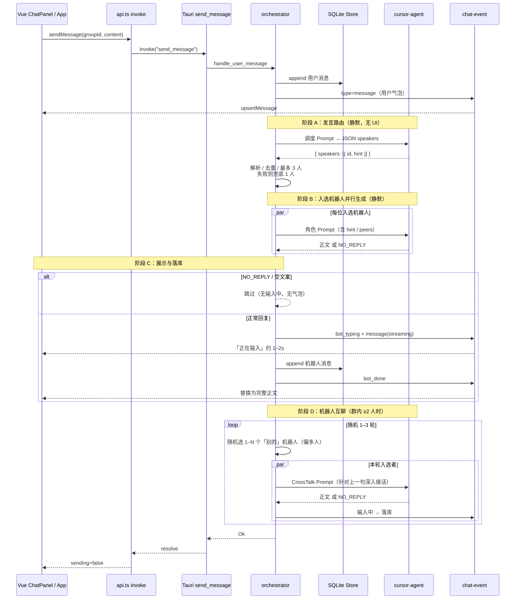

# 消息路由与回复链路

本文描述用户发一条群聊消息后，从 UI 到 `cursor-agent`、再到气泡落库的完整链路（以当前 `src-tauri/src/orchestrator.rs` 为准）。

## 总览



## 参与模块

| 层 | 路径 | 职责 |
|----|------|------|
| UI | `src/components/ChatPanel.vue` | 输入框发送；渲染气泡 / 「正在输入」 |
| UI 状态 | `src/App.vue` | `onSend` → `sendMessage`；监听 `chat-event` 更新列表 |
| 前端桥 | `src/api.ts` | `invoke('send_message', { groupId, content })` |
| 命令 | `src-tauri/src/lib.rs` | `send_message` → `orchestrator::handle_user_message` |
| 编排 | `src-tauri/src/orchestrator.rs` | 落库用户消息、路由、生成、打字延迟、发事件 |
| Agent | `src-tauri/src/cursor.rs` | `spawn cursor-agent`（stream / text） |
| 存储 | `src-tauri/src/store.rs` | SQLite：`groups` / `bots` / `messages` |

## 阶段拆解

### 0. 入口（前端 → 后端）

1. 用户在 `ChatPanel` 按 Enter / 点发送。
2. `App.onSend` 设 `sending=true`，调用 `sendMessage(activeId, content)`。
3. Tauri 命令 `send_message` **同步 await** 整条编排结束（含路由 + 首批回复 + 互聊），期间 UI 靠事件增量更新。

### 1. 用户消息落库并推送

`handle_user_message`：

1. `trim`；空内容直接报错。
2. SQLite `append_message`（`sender_type=user`，`status=done`）。
3. 读取该群全部 `bots`，以及最近约 30 条历史（不含本条用户消息）拼成 `history_text`。
4. `emit chat-event`：`type=message`，前端立刻出现用户气泡。
5. 若群内无机器人，流程结束。

### 2. 消息路由（发言调度）

目标：先根据上下文判断**谁最适合开口**，避免全员齐刷、内容雷同。若用户消息里出现 **`@昵称`**，则**强制**这些机器人回复，跳过 LLM 调度。

常量：

- `HISTORY_LIMIT = 30`
- `MAX_SPEAKERS = 3`

逻辑（`select_speakers`）：

| 情况 | 行为 |
|------|------|
| 0 个机器人 | 不调度 |
| 1 个机器人 | 跳过 LLM 调度，直接该人发言 |
| 消息含 `@所有人` / `@all` | 强制群内**全部**机器人回复 |
| 消息含 `@昵称` | 按最长昵称匹配，强制入选这些机器人 |
| 用户撤回消息 | 标记 `recalled`，删除本回合已生成的 bot 回复，并 `cancel` 中止后续生成 |
| ≥ 2 个且无 @ | 调 `cursor-agent` 调度，再 `diversify_selection` |

调度 Prompt 要求模型只输出 JSON，例如：

```json
{
  "speakers": [
    { "id": "机器人uuid", "hint": "从可行性角度说" }
  ]
}
```

解析规则（`parse_route_selection` + `diversify_selection`）：

1. 从模型输出中截取第一个 `{` … 最后一个 `}`。
2. 优先读 `speakers[]`（按 `id` / `nickname` 匹配群内机器人）。
3. 若为空，再读 `ids[]`。
4. 去重，截断到最多 3 人。
5. **解析失败**：随机抽 1–N 人（偏多人）。
6. **`diversify_selection`**：按随机目标人数扩选 / 截断 / 打乱，避免总是只剩 1 人。

调度阶段**不发任何 UI 事件**（静默）。

### 3. 入选机器人并行回复

对每个 `SelectedBot`：

1. 组装角色 Prompt（`build_prompt`），附带：
   - 可选 `hint`（本轮发言侧重）
   - 同轮其他入选成员及他们的 hint（要求避免重复观点）
   - 身份设定、近期历史、用户本句
   - 规则：只输出正文；不想说则只输出 `NO_REPLY`
2. 先 `run_cursor_agent_stream`（回调丢弃 delta，静默生成）；失败再 fallback `run_cursor_agent_text`。
3. 成功时把返回的 `chat_id` 写回该 bot 的 `cursor_chat_id`（便于 `--resume` 续聊）。
4. 多入选者用 `tokio::spawn` **并行**生成。

未入选的机器人：本轮不调用、不出现「正在输入」、不落库。

### 4. 「不回话」判定

生成完成后，若正文被判定为沉默（`is_no_reply`），则：

- **不**发 `bot_typing`
- **不**写入 `messages`
- **不**出现聊天气泡

识别包括：空串、`NO_REPLY` / `noreply`、短句「不回话」「（昵称不回话）」等占位。

### 5. 展示节奏：先输入中，再整段发出

内容就绪且非沉默时：

1. 构造临时消息 `status=streaming`、`content=""`（**不落库**）。
2. `emit bot_typing` + `emit message` → UI 显示「正在输入」。
3. `sleep` 随机 **1–2 秒**（`TYPING_DELAY_MIN_MS` … `MAX`）。
4. SQLite `append_message`（完整正文，`status=done`）。
5. `emit bot_done` → UI 用同一 `id` 替换为完整气泡。

生成失败时：落库 `status=error` 文案，并 `emit bot_error`。

### 6. 机器人互聊（深度接话）

用户回合的首批复完后，若群内 **≥ 2** 个机器人且已有成功 bot 发言，进入 `run_crosstalk_rounds`：

1. 随机决定互聊轮数：`CHAIN_ROUNDS_MIN..=CHAIN_ROUNDS_MAX`（当前 **1–3**）。
2. 每一轮：
   - 以库中最新一条成功 bot 消息为「上一句」；
   - 从**其他人**里随机选出 **1–N** 人（`N≤MAX_SPEAKERS`，优先本回合尚未发过言的；人数偏多人）；
   - 刷新历史，用 `TurnKind::CrossTalk` Prompt 并行接话；正文强制以 **`@上一发言者昵称`** 开头（缺失则系统补全），气泡里高亮展示；
   - 仍走静默生成 → 「正在输入」1–2s → 落库；
   - 若本轮无人开口则进入下一轮；
   - 轮与轮之间短暂间隔（约 0.35–0.8s）。
3. **硬上限**：最多 3 轮互聊，不会无限级联。

仅 1 个机器人时跳过互聊。

### 7. 前端事件消费

`App.handleChatEvent` 仅处理当前 `activeId` 群：

| `type` | 行为 |
|--------|------|
| `message` | `upsertMessage`（用户消息 / 临时 streaming） |
| `bot_typing` | `upsertMessage`（「正在输入」） |
| `bot_done` / `bot_error` | `upsertMessage`（定稿或错误） |
| `group_updated` | 刷新群列表（当前编排主路径一般不发） |

`ChatPanel`：`status === 'streaming' && !content` 时渲染「正在输入」。

## 关键常量速查

| 常量 | 值 | 含义 |
|------|-----|------|
| `HISTORY_LIMIT` | 30 | 拼进 Prompt 的近期消息条数上限 |
| `MAX_SPEAKERS` | 3 | 用户回合首批最多开口人数 |
| `CHAIN_ROUNDS_*` | 1–3 | 首批回复后的机器人互聊轮数 |
| `TYPING_DELAY_*` | 1000–2000 ms | 「正在输入」展示时长 |

## 设计要点

1. **用户消息启动整轮**：先路由首批回复，再可选互聊；互聊不会再次触发「用户路由」。
2. **路由在首批回复之前**：先选人，再生成；未选中者不进入首批。
3. **互聊有界**：随机 1–3 轮、每次换人、硬上限，避免死循环刷屏。
4. **静默生成**：路由与正文生成阶段都不刷流式字；UI 只在定稿前短暂「正在输入」。
5. **差异化**：首批用 `hint` + peers；互聊用 CrossTalk Prompt 针对上一句深入聊。
6. **持久化**：只有用户消息与最终 bot 消息（含 error）进 SQLite；streaming 占位不落库。

## 相关源码

- 编排与路由：[`src-tauri/src/orchestrator.rs`](../src-tauri/src/orchestrator.rs)
- Agent 调用：[`src-tauri/src/cursor.rs`](../src-tauri/src/cursor.rs)
- 命令入口：[`src-tauri/src/lib.rs`](../src-tauri/src/lib.rs)（`send_message`）
- 前端发送与事件：[`src/App.vue`](../src/App.vue)、[`src/api.ts`](../src/api.ts)
